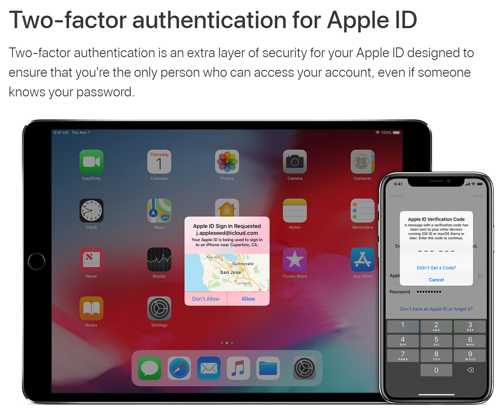

**Trusted Devices**
• อุปกรณ์ของ Apple เช่น IPhone หรือ IPad ที่เราได้ทำการเปิดใช้งาน Two Factor Authentication และตรวจสอบได้ว่าเป็นอุปกรณ์ของเราจริง

**Trusted Phone Numbers**
•	หมายเลขโทรศัพท์ที่นำมาใช้รับรหัส สำหรับการตรวจสอบยืนยันผ่านทางข้อความ

**Verification Codes**
•	เป็นรหัสชั่วคราวที่จะส่งไปยังอุปกรณ์หรือหมายเลขโทรศัพท์ เมื่อทำการ Login เข้าใช้ Apple ID บนอุปกรณ์หรือ Browsers ใหม่

**ตัวอย่างขั้นตอนในการ Login ICloud**
