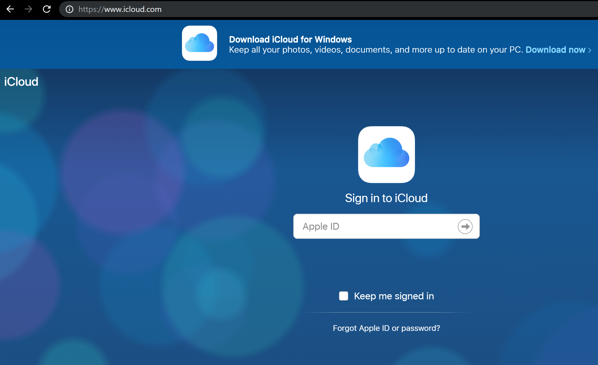
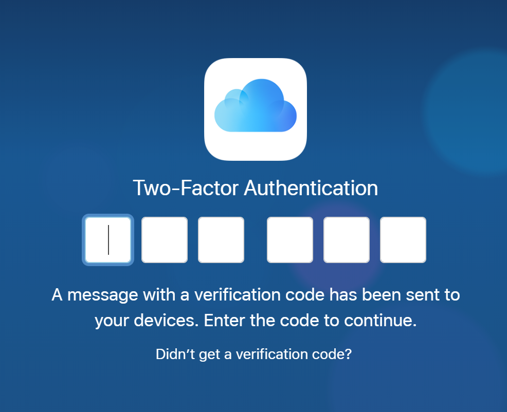
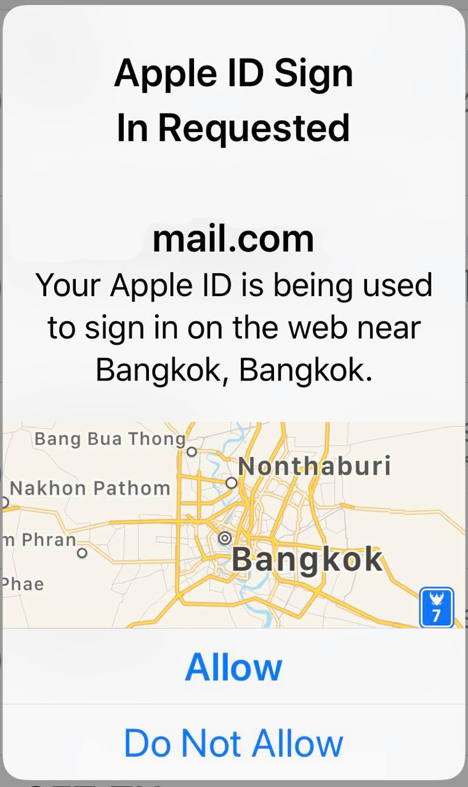
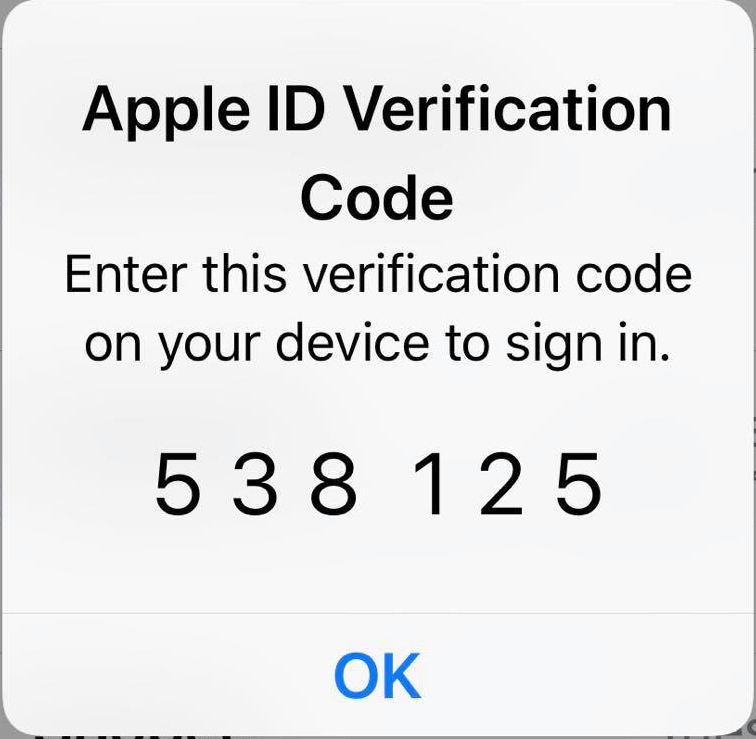
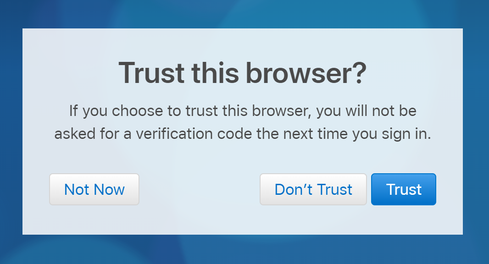
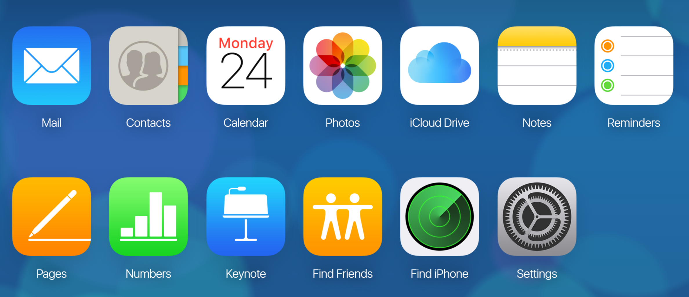
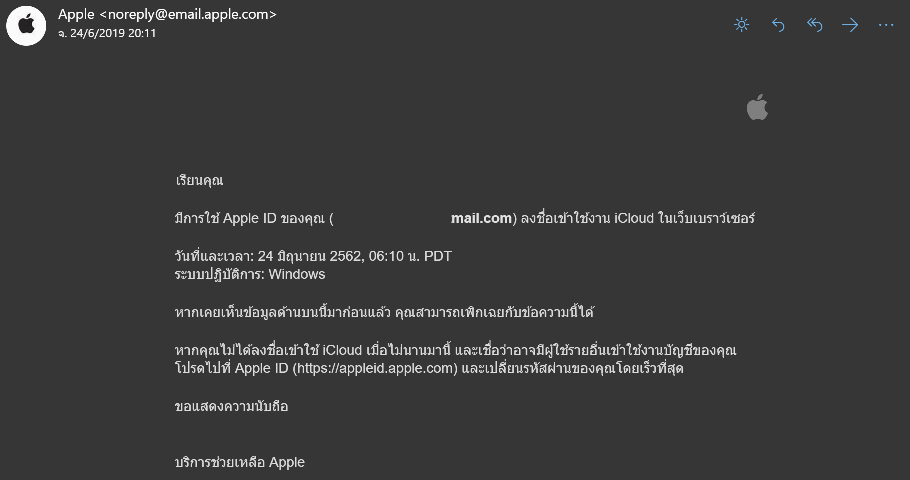

  * Two-Factor Authentication หรือ ระบบการยืนยันตัวตนแบบสองชั้น ซึ่งจะมีประโยชน์ที่เห็นได้ชัด ในกรณีที่ชื่อผู้ใช้และรหัสผ่านของเรา ตกไปอยู่ในมือของคนอื่น และมีเจตนาจะนำข้อมูลเหล่านั้นของเราไปกรอกเข้าระบบ จะไม่สามารถเข้าใช้งานได้ เพราะรหัสอีกชุดหนึ่งจะถูกส่งเข้าโทรศัพท์ หรืออีเมล์ส่วนตัว

**Trusted Devices**

  * อุปกรณ์ของ Apple เช่น IPhone หรือ IPad ที่เราได้ทำการเปิดใช้งาน Two Factor Authentication และตรวจสอบได้ว่าเป็นอุปกรณ์ของเราจริง

**Trusted Phone Numbers**

  *	หมายเลขโทรศัพท์ที่นำมาใช้รับรหัส สำหรับการตรวจสอบยืนยันผ่านทางข้อความ

**Verification Codes**

  *	เป็นรหัสชั่วคราวที่จะส่งไปยังอุปกรณ์หรือหมายเลขโทรศัพท์ เมื่อทำการ Login เข้าใช้ Apple ID บนอุปกรณ์หรือ Browsers ใหม่

**ตัวอย่างขั้นตอนในการ Login ICloud**

  * หน้าตาของเข้าใช้งาน ICloud ผ่าน Web Browers
  

  * เมื่อทำการใส่ Username และ Password เสร็จแล้ว ระบบจะทำการถามถึง Verification Code

  * บน Device ส่วนตัวของเราจะมีการแจ้งเตือน ว่ามีการพยายามจะ Login เข้าใช้งาน Apple ID ของเรา พร้อมทั้งแจ้งพิกัดของเครื่องที่มีการทำ Login ดังกล่าว

  * ซึ่งหากเรา กด Allow ยอมรับว่าเป็นตัวเราเอง เราก็จะได้รับ Apple ID Verification Code มาซึ่งเป็นตัวเลข 6 หลักให้เรานำไปใส่ในหน้า ICloud

  * เมื่อเรากรอกเสร็จแล้ว Login เข้าใช้งาน ก็จะมี Pop Up เด้งมาถามว่า เราต้องการที่จะยอมรับ browser นี้ไหม ถ้าเรา เลือก Trust ครั้งต่อไปที่เรา Login ก็จะไม่ต้องทำการขอ Verification Code

  * เมื่อเราทำการ Login เข้าใช้งานสำเร็จ

  * เมื่อทำการเช็ค Email ก็จะพบการแจ้งเตือนว่า Apple ID ของเรามีการเข้าใช้งาน ICloud ในวันและเวลา แจ้งมาบอก
  
**Reference**

  * https://support.apple.com/en-us/HT204915
  * https://www.icloud.com/
