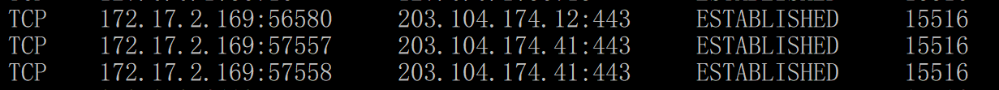

**Test Case: Sensitive or Private Information that is required to be encrypted**

**Precondition**: Line application and access on PC 

**Input**: Send chat to another

**Actions**: Packet sniffing between sending chat

**Expected Result**: Data encrypted by using TLS protocol
1. Check process id from Line application

2. Check destination ip from process id

3. Focus on row that have TLSv1.2 protocol

